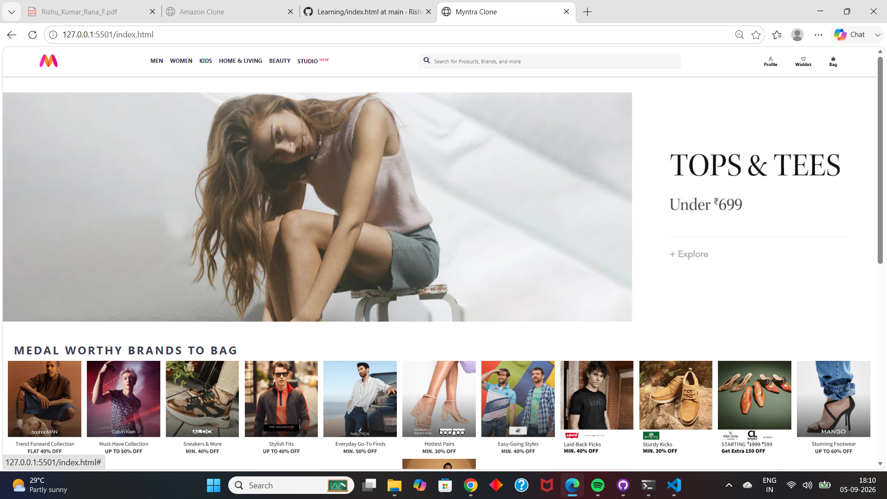

🛍️ Myntra Clone

A Myntra-inspired fashion e-commerce frontend built using HTML5, CSS3,
Flexbox, and Font Awesome.

This project recreates the main visual components of a fashion
e-commerce website, including navigation, search, promotional banners,
category sections, profile, wishlist, shopping bag, and footer.

🚀 Features

Myntra-style navigation bar

Myntra logo

Category navigation:

Men

Women

Kids

Home & Living

Beauty

Studio

Search bar with search icon

Profile section

Wishlist section

Shopping Bag section

Promotional banner

"Medal Worthy Brands to Bag" section

"Shop by Category" section

Multiple fashion category images

Structured footer with useful links

Hover effects on navigation items

🛠️ Technologies Used

HTML5 -- Used to structure the webpage

CSS3 -- Used for styling and layout

Flexbox -- Used to arrange navigation, categories, and footer
sections

Font Awesome -- Used for search, profile, wishlist, and bag
icons

📋 Project Overview

Navigation Bar

The navigation bar contains the Myntra logo, category links, search bar,
and user action sections such as Profile, Wishlist, and Bag.

Promotional Banner

A large promotional banner is displayed below the navigation bar to
create a fashion-focused homepage layout.

Brand Section

The project includes a "Medal Worthy Brands to Bag" section
containing multiple promotional brand images.

Shop by Category

The "Shop by Category" section displays multiple category images
arranged using CSS Flexbox.

Footer

The footer contains sections such as Online Shopping, Customer Policies,
and Useful Links, along with copyright information.

🎨 Styling & Layout

The project uses CSS Flexbox to create flexible layouts for the
navigation bar, category sections, and footer. It also includes hover
effects, background colors, custom spacing, and flexible-width elements.

📂 Project Structure

Myntra-Clone/
│
├── index.html
├── style.css
├── myntra_logo.webp
├── banner.jpg
├── category/
│   ├── 1.png
│   ├── 2.png
│   ├── ...
│   └── 12.png
│
├── Offer/
│   ├── 1.jpg
│   ├── 2.jpg
│   ├── ...
│   └── 10.jpg
│
└── README.md

📸 Preview

🎯 Learning Outcomes

Through this project, I practiced:

Creating webpage layouts using HTML5

Styling webpages using CSS3

Working with CSS Flexbox

Creating navigation bars

Creating search and action sections

Using images in webpages

Adding hover effects

Using Font Awesome icons

Creating structured footer sections

Organizing webpage content into different sections

🔮 Future Improvements

Add JavaScript functionality

Make the search bar functional

Add product pages

Add working Profile, Wishlist, and Bag sections

Add product filtering and sorting

Add responsive mobile design

Add shopping cart functionality

Connect the frontend to a backend/API

👨‍💻 Author

Rishu Kumar Rana

Built as a frontend development practice project to improve HTML5, CSS3,
and Flexbox skills.

⚠️ Disclaimer

This project is created for educational and practice purposes only.

It is not affiliated with or endorsed by Myntra.